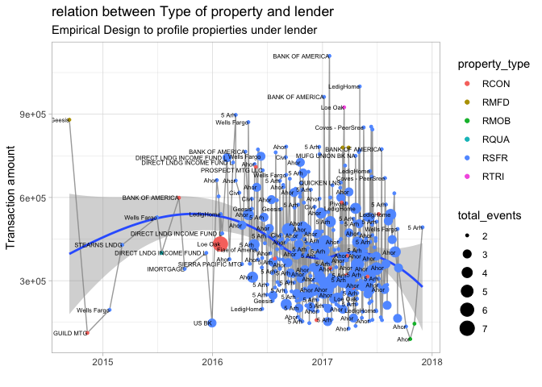

Lender approach
================

``` r
library(tidyverse)
library(tidymodels)
library(scales)
library(lubridate)
library(corrr)
library(corrplot)
library(tidymetrics)
library(outliers)
library(AnomalyDetection)
library(naniar)
library(finetune)
theme_set(theme_light())
```

``` r
properties<-read_csv('../test/LH data/properties.csv')
transactions<-read_csv('../test/LH data/transactions.csv')
```

``` r
anomalies<-AnomalyDetectionVec(transactions$transaction_amount,max_anoms = 0.3,direction = 'both',period = 48,plot = TRUE)

anoms<-anomalies$anoms$anoms

transactions<-transactions%>%
  filter(!transaction_amount %in% anoms)


properties<-properties%>%
  filter(year_built!=0)

full_data_set<-properties %>%
  left_join(transactions, by = 'property_id')

full_data_set<-full_data_set %>%
  mutate(lender = str_remove_all(lender,'[*]'),
         lender = str_remove_all(lender,'[[::punct::]]'))

full_data_set_clean<-full_data_set%>%
  filter(!is.na(property_address)) %>%
  select(-property_address)

data_model<-full_data_set_clean %>% 
  filter(year_built>=1930) %>%
  select(-c(property_id,seller,buyer)) %>%
  na.omit() 
```

``` r
data_model%>%
  group_by(lender) %>%
  count(sort = T)%>%
  filter(n>30)
```

    ## # A tibble: 36 × 2
    ## # Groups:   lender [36]
    ##    lender                          n
    ##    <chr>                       <int>
    ##  1 " Udislosed"                 9504
    ##  2 "OTHER INSTITUTIONAL LENDE"   615
    ##  3 "Ahor"                        552
    ##  4 "LedigHome"                   348
    ##  5 "5 Arh"                       230
    ##  6 "Wells Fargo"                 223
    ##  7 "Geesis"                      106
    ##  8 "Pivoal"                      106
    ##  9 "Civi"                         99
    ## 10 " OTHER INSTITUTIONAL LEN"     81
    ## # … with 26 more rows

``` r
lender_filter<-data_model%>%
  group_by(lender) %>%
  count(sort = T)%>%
  filter(n>30)

data_model%>%
  mutate(lender=str_trim(lender))%>%
  filter(lender!='OTHER INSTITUTIONAL LEN')%>%
  filter(lender!='OTHER INSTITUTIONAL LENDE')%>%
  filter(lender %in% lender_filter$lender) %>%
  group_by(lender,transaction_date,property_type) %>%
  summarize(transaction_amount=mean(transaction_amount),
            total_events=n()) %>%
  group_by(property_type,transaction_date)%>%
  mutate(total_transactions=sum(transaction_amount),
         pct_transaction=transaction_amount/total_transactions)%>%
  filter(total_events>1) %>%
  ungroup() %>%
  ggplot(aes(transaction_date,transaction_amount))+
  geom_line(alpha=0.4)+
  geom_smooth(group=1,method = 'loess')+
  geom_point(aes(size=total_events,color=property_type))+
  geom_text(aes(label=lender),
            check_overlap = TRUE,
            hjust=1,
            size=2)+
  labs(title = 'relation between Type of property and lender',
       subtitle = 'Empirical Design to profile propierties under lender',
       x='',
       y='Transaction amount')
```

<!-- -->

``` r
#geom_text(aes(label=property_type),check_overlap = TRUE,hjust=1, show.legend = F)
```

Here I try evaluate the profile and efects to transactions under lender
focus and total events by date

My metric are ratio between total transaction for all propierties by
lender

``` r
data_model%>%
  mutate(lender=str_trim(lender))%>%
  filter(lender!='OTHER INSTITUTIONAL LEN')%>%
  filter(lender!='OTHER INSTITUTIONAL LENDE')%>%
  filter(lender %in% lender_filter$lender) %>%
  group_by(lender,transaction_date,property_type) %>%
  summarize(transaction_amount=mean(transaction_amount),
            total_events=n()) %>%
  group_by(property_type,transaction_date)%>%
  mutate(total_transactions=sum(transaction_amount),
         pct_transaction=transaction_amount/total_transactions)%>%
  filter(total_events>1) %>%
  ungroup() %>%
  sample_n(10)%>%
  as_tibble()%>%
  select(-c(transaction_amount,total_events))
```

    ## # A tibble: 10 × 5
    ##    lender        transaction_date property_type total_transacti… pct_transaction
    ##    <chr>         <date>           <chr>                    <dbl>           <dbl>
    ##  1 Ahor          2016-08-11       RSFR                  1746000            0.216
    ##  2 Ahor          2016-08-24       RSFR                  2190500            0.291
    ##  3 Coves - Peer… 2017-04-28       RSFR                  3998750            0.110
    ##  4 Ahor          2016-09-09       RSFR                  2601950            0.114
    ##  5 Civi          2016-03-30       RSFR                  2103000            0.293
    ##  6 Ahor          2016-10-06       RSFR                  1195250            0.332
    ##  7 Ahor          2016-07-05       RSFR                   473000            1    
    ##  8 Ahor          2016-09-08       RSFR                  2570000            0.142
    ##  9 5 Arh         2017-07-31       RSFR                  2153667.           0.267
    ## 10 Ahor          2016-10-21       RSFR                  2132250            0.144
