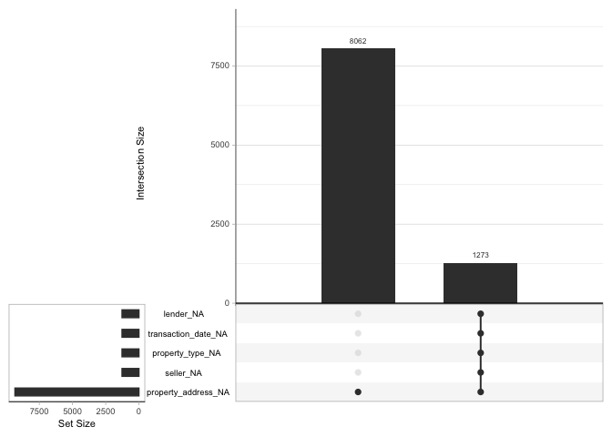
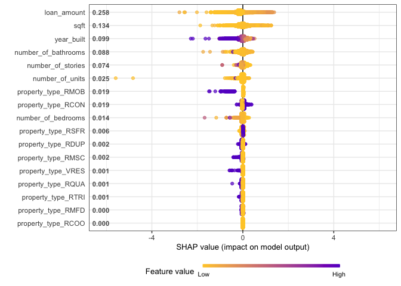

Statitical Application in Machine Learning to properties transcations
================

``` r
library(tidyverse)
library(tidymodels)
library(scales)
library(lubridate)
library(corrr)
library(corrplot)
library(tidymetrics)
library(vip)
library(outliers)
library(AnomalyDetection)
library(naniar)
library(finetune)
library(SHAPforxgboost)
theme_set(theme_light())
```

``` r
properties<-read_csv('properties.csv')
transactions<-read_csv('transactions.csv')
```

## Exploratory Data Analysis

### Anomaly detections

``` r
transactions_trends<-transactions %>%
  group_by(transaction_date)%>%
  summarize(transaction_amount=mean(transaction_amount)) %>%
  select(transaction_date,transaction_amount)%>%
  rename(date=transaction_date)%>%
  cross_by_periods(c("month", "quarter"))


transactions_trends%>%
  filter(period=='month') %>%
  ggplot(aes(transaction_amount,date,group=date))+
  geom_boxplot(outlier.colour = 'red')+
  labs(title = 'First Evaluation to Understand Outliers',
       subtitle = 'Transactions case, windows:Month')+
  scale_x_continuous(labels = comma)
```

<!-- -->

``` r
transactions_trends%>%
  filter(period!='month') %>%
  ggplot(aes(transaction_amount,date,group=date))+
  geom_boxplot(outlier.colour = 'red')+
  labs(title = 'First Evaluation to Understand Outliers',
       subtitle = 'Transactions case, windows:quarter')+
  scale_y_continuous(labels = comma)
```

<!-- -->
Evidence indicates that we have sufficient evidence to substantiate
outliers data

### Resolving problem Outliers Data

Classical Test: Grubbs[1] , with Grubbs test allows to detect whether
the highest or lowest value in a dataset is an outlier.

-   My Null Hypothesis says that :There is no outlier in the data.

``` r
grubbs.test(transactions_trends%>%
              ungroup() %>%
  filter(period!='month')%>%
    select(transaction_amount) %>%
    pull())
```

    ## 
    ##  Grubbs test for one outlier
    ## 
    ## data:  transactions_trends %>% ungroup() %>% filter(period != "month") %>%     select(transaction_amount) %>% pull()
    ## G = 11.71987, U = 0.84839, p-value < 2.2e-16
    ## alternative hypothesis: highest value 6388009.06666667 is an outlier

Since this value is less than 0.05, we will reject the null
hypothesis!!!

Now I try indentify this anomalies values and evaluate the next steps

``` r
transactions_trends %>%
  filter(period!='month')%>%
  group_by(date) %>%
  summarize(transaction_amount=mean(transaction_amount)) %>%
  ggplot(aes(date,transaction_amount))+
  geom_line()+
  geom_point(aes(size=transaction_amount))+
  geom_smooth(method = 'loess')+
  scale_y_continuous(labels = comma)+
  scale_size_continuous(labels= comma)+
  labs(title = 'Trends Evaluation to transaction amount',
       subtitle = 'Windows: Month')
```

<!-- -->

``` r
anomalies<-AnomalyDetectionVec(transactions$transaction_amount,max_anoms = 0.3,direction = 'both',period = 48,plot = TRUE)
anomalies$plot
```

<!-- -->

I find 4.85 % values are anomalies.

I remove this values

``` r
anoms<-anomalies$anoms$anoms

transactions<-transactions%>%
  filter(!transaction_amount %in% anoms)


transactions_trends<-transactions %>%
  group_by(transaction_date)%>%
  summarize(transaction_amount=mean(transaction_amount)) %>%
  select(transaction_date,transaction_amount)%>%
  rename(date=transaction_date)%>%
  cross_by_periods(c("month"))


transactions_trends%>%
  filter(period=='month') %>%
  ggplot(aes(transaction_amount,date,group=date))+
  geom_boxplot(outlier.colour = 'red')+
  labs(title = 'First Evaluation to Understand Outliers',
       subtitle = 'Transactions case, windows:Month')+
  scale_x_continuous(labels = comma)
```

<!-- -->

We have most normal data distribution

``` r
transactions_trends%>%
  ggplot(aes(transaction_amount))+
  geom_histogram()+
  labs(title = 'Transactions Distributions')
```

<!-- -->

### Join Data

``` r
properties<-properties%>%
  filter(year_built!=0)

full_data_set<-properties %>%
  left_join(transactions, by = 'property_id')


full_data_set %>%
  head()
```

    ## # A tibble: 6 × 15
    ##   property_id year_built  sqft number_of_bathrooms number_of_bedrooms
    ##         <dbl>      <dbl> <dbl>               <dbl>              <dbl>
    ## 1    28590358       1950   876                 1                    2
    ## 2    28597808       1963  2161                 2                    4
    ## 3    28610026       1936   872                 1                    2
    ## 4    28616891       1989  2506                 2.5                  2
    ## 5    23809874       1959  1082                 1                    3
    ## 6    23887557       1900  1419                 1                    3
    ## # … with 10 more variables: number_of_stories <dbl>, number_of_units <dbl>,
    ## #   transaction_amount <dbl>, loan_amount <dbl>, buyer <chr>, lender <chr>,
    ## #   transaction_date <date>, property_type <chr>, property_address <chr>,
    ## #   seller <chr>

``` r
full_data_set %>%
  filter(!is.na(property_type)) %>%
  ggplot(aes(transaction_amount, fill=property_type))+
  geom_histogram(alpha=0.5)+
  labs(title = 'Transaction amount distribution',
       subtitle = 'by property type')
```

<!-- -->

## Machine Learning model

Goal: Predict transaction\_amount

``` r
# Cleaning Data 
full_data_set<-full_data_set %>%
  mutate(lender = str_remove_all(lender,'[*]'),
         lender = str_remove_all(lender,'[[::punct::]]'))

## Evaluate Missing Info
 gg_miss_upset(full_data_set)
```

<!-- -->
Decisions:

-   Drop address
-   Evaluate other missing Data

``` r
full_data_set_clean<-full_data_set%>%
  filter(!is.na(property_address)) %>%
  select(-property_address)

gg_miss_var(full_data_set_clean)
```

<!-- -->

### Evaluate year\_built

``` r
full_data_set_clean %>%
  ggplot(aes(year_built,loan_amount,group=year_built))+
  geom_boxplot()
```

<!-- -->

``` r
full_data_set_clean %>%
  group_by(year_built) %>%
  count() %>%
  ggplot(aes(year_built,n))+
  geom_point()+
  geom_vline(xintercept = 1950)+
  geom_vline(xintercept = 1930, color='gray')+
  labs(title = 'Evaluating Structural changes')
```

<!-- -->
\#\#\# Evaluate correlations variables

``` r
cor(full_data_set_clean%>%select_if(is.numeric)%>%select(-property_id))%>%
  corrplot(method = 'number')
```

<!-- -->
For this values, I think that the appropiate model is : Xgboost

``` r
cor.test(full_data_set_clean$transaction_amount, full_data_set_clean$number_of_bedrooms)
```

    ## 
    ##  Pearson's product-moment correlation
    ## 
    ## data:  full_data_set_clean$transaction_amount and full_data_set_clean$number_of_bedrooms
    ## t = 21.831, df = 19992, p-value < 2.2e-16
    ## alternative hypothesis: true correlation is not equal to 0
    ## 95 percent confidence interval:
    ##  0.1390207 0.1660979
    ## sample estimates:
    ##      cor 
    ## 0.152588

### Modelling

``` r
data_model<-full_data_set_clean %>% 
  filter(year_built>=1930) %>%
  select(-c(property_id,seller,buyer,lender,transaction_date,transaction_date)) %>%
  na.omit() %>%
  mutate(transaction_amount=log(transaction_amount +1))

set.seed(1234)

spl<-initial_split(data_model,strata = transaction_amount)
train_set <- training(spl)
test_model<- testing(spl)

mset <- metric_set(rmse)
grid_control <- control_grid(save_pred = TRUE,
                             save_workflow = TRUE,
                             extract = extract_model)
set.seed(2021)
train_fold <- train_set %>%
  vfold_cv(10)


xg_rec <- recipe(transaction_amount ~ ., data = train_set) %>%
  step_dummy(all_nominal_predictors())

xg_mod <- boost_tree("regression",
                     mtry = tune(),
                     trees = tune(),
                     learn_rate = tune()) %>%
  set_engine("xgboost")

xg_wf <- workflow() %>%
  add_recipe(xg_rec) %>%
  add_model(xg_mod)

mset <- metric_set(rmse)

xg_tune <- xg_wf %>%
  tune_grid(train_fold,
            metrics = mset,
            control = grid_control,
            grid = crossing(mtry = c(3,7,10),
                            trees = seq(250, 1500, 50),
                            learn_rate = c(0.001,.008, .01,0.3)))

autoplot(xg_tune)
```

<!-- -->

``` r
xg_tune %>%
  collect_metrics() %>%
  arrange(mean)
```

    ## # A tibble: 312 × 9
    ##     mtry trees learn_rate .metric .estimator  mean     n std_err .config        
    ##    <dbl> <dbl>      <dbl> <chr>   <chr>      <dbl> <int>   <dbl> <chr>          
    ##  1    10  1500       0.01 rmse    standard   0.607    10  0.0200 Preprocessor1_…
    ##  2    10  1450       0.01 rmse    standard   0.607    10  0.0201 Preprocessor1_…
    ##  3    10  1400       0.01 rmse    standard   0.607    10  0.0201 Preprocessor1_…
    ##  4    10  1350       0.01 rmse    standard   0.607    10  0.0201 Preprocessor1_…
    ##  5    10  1300       0.01 rmse    standard   0.607    10  0.0201 Preprocessor1_…
    ##  6    10  1250       0.01 rmse    standard   0.607    10  0.0202 Preprocessor1_…
    ##  7    10  1200       0.01 rmse    standard   0.607    10  0.0202 Preprocessor1_…
    ##  8     7  1500       0.01 rmse    standard   0.607    10  0.0200 Preprocessor1_…
    ##  9    10  1150       0.01 rmse    standard   0.607    10  0.0202 Preprocessor1_…
    ## 10     7  1450       0.01 rmse    standard   0.607    10  0.0200 Preprocessor1_…
    ## # … with 302 more rows

``` r
xgb_last <-
  xg_wf %>%
  finalize_workflow(select_best(xg_tune, "rmse")) %>%
  last_fit(spl)

xgb_last%>%
  unnest(.metrics)
```

    ## # A tibble: 2 × 9
    ##   splits               id          .metric .estimator .estimate .config .notes  
    ##   <list>               <chr>       <chr>   <chr>          <dbl> <chr>   <list>  
    ## 1 <split [13245/4417]> train/test… rmse    standard       0.528 Prepro… <tibble>
    ## 2 <split [13245/4417]> train/test… rsq     standard       0.514 Prepro… <tibble>
    ## # … with 2 more variables: .predictions <list>, .workflow <list>

Not is a bad performance

``` r
xg_wf %>%
  finalize_workflow(select_best(xg_tune, "rmse")) %>%
  fit(train_set)%>%
  augment(test_model)%>%
  ggplot(aes(exp(transaction_amount),exp(.pred),color=property_type))+
  geom_abline(slope = 1, lty = 2, color = "gray50", alpha = 0.5) +
  geom_point(alpha = 0.2)+
  labs(title = 'Model Performance with Xgboost')
```

<!-- -->

``` r
xgb_fit <- extract_fit_parsnip(xgb_last)
vip(xgb_fit, geom = "point", num_features = 12)
```

<!-- -->

``` r
transaction_amount_shap <-
  shap.prep(
    xgb_model = extract_fit_engine(xgb_fit),
    X_train = bake(prep(xg_rec),
      has_role("predictor"),
      new_data = NULL,
      composition = "matrix"
    )
  )

shap.plot.summary(transaction_amount_shap)
```

<!-- -->

I use a model-agnostic approach like Shapley Additive Explanations,
where the average contributions of features are computed under different
combinations or “coalitions” of feature orderings.

## Other approach

``` r
library(baguette)
data_model<-full_data_set_clean %>% 
  filter(year_built>=1930) %>%
  select(-c(property_id,seller,buyer,lender,transaction_date,transaction_date)) %>%
  mutate(transaction_amount=log(transaction_amount +1))%>%
  na.omit()

set.seed(1234)

spl<-initial_split(data_model,strata = transaction_amount)
train_set <- training(spl)
test_model<- testing(spl)

set.seed(234)
transaction_folds <- vfold_cv(train_set, v = 5, strata = transaction_amount)


xg_rec <- recipe(transaction_amount ~ ., data = train_set) %>%
   step_novel(property_type)


bag_spec <-
  bag_tree(min_n = 10) %>%
  set_engine("rpart", times = 25) %>%
  set_mode("regression")

bag_wf <-
  workflow() %>%
  add_recipe(xg_rec) %>%
  add_model(bag_spec)

set.seed(123)
bag_fit <- fit(bag_wf, data = train_set)
```

``` r
set.seed(123)
bag_rs <- fit_resamples(bag_wf, transaction_folds)

collect_metrics(bag_rs)
```

    ## # A tibble: 2 × 6
    ##   .metric .estimator  mean     n std_err .config             
    ##   <chr>   <chr>      <dbl> <int>   <dbl> <chr>               
    ## 1 rmse    standard   0.635     5  0.0277 Preprocessor1_Model1
    ## 2 rsq     standard   0.418     5  0.0195 Preprocessor1_Model1

``` r
test_rs <- augment(bag_fit, test_model)
test_rs %>%
  ggplot(aes(exp(transaction_amount),exp(.pred),color=property_type))+
  geom_abline(slope = 1, lty = 2, color = "gray50", alpha = 0.5) +
  geom_point(alpha = 0.2) +
  labs(title = 'Model Performance with CART (decision tree) ')
```

<!-- -->

``` r
library(rlang)

rmsle_vec <- function(truth, estimate, na_rm = TRUE, ...) {
  rmsle_impl <- function(truth, estimate) {
    sqrt(mean((log(truth + 1) - log(estimate + 1))^2))
  }

  metric_vec_template(
    metric_impl = rmsle_impl,
    truth = truth,
    estimate = estimate,
    na_rm = na_rm,
    cls = "numeric",
    ...
  )
}

rmsle <- function(data, ...) {
  UseMethod("rmsle")
}
rmsle <- new_numeric_metric(rmsle, direction = "minimize")

rmsle.data.frame <- function(data, truth, estimate, na_rm = TRUE, ...) {
  metric_summarizer(
    metric_nm = "rmsle",
    metric_fn = rmsle_vec,
    data = data,
    truth = !!enquo(truth),
    estimate = !!enquo(estimate),
    na_rm = na_rm,
    ...
  )
}
```

``` r
test_rs %>%
  rmse(transaction_amount, .pred)
```

    ## # A tibble: 1 × 3
    ##   .metric .estimator .estimate
    ##   <chr>   <chr>          <dbl>
    ## 1 rmse    standard       0.547

``` r
test_rs %>%
  mutate(across(c(transaction_amount, .pred), exp)) %>%
  rmsle(transaction_amount, .pred)
```

    ## # A tibble: 1 × 3
    ##   .metric .estimator .estimate
    ##   <chr>   <chr>          <dbl>
    ## 1 rmsle   standard       0.547

[1] <https://en.wikipedia.org/wiki/Grubbs%27s_test>
